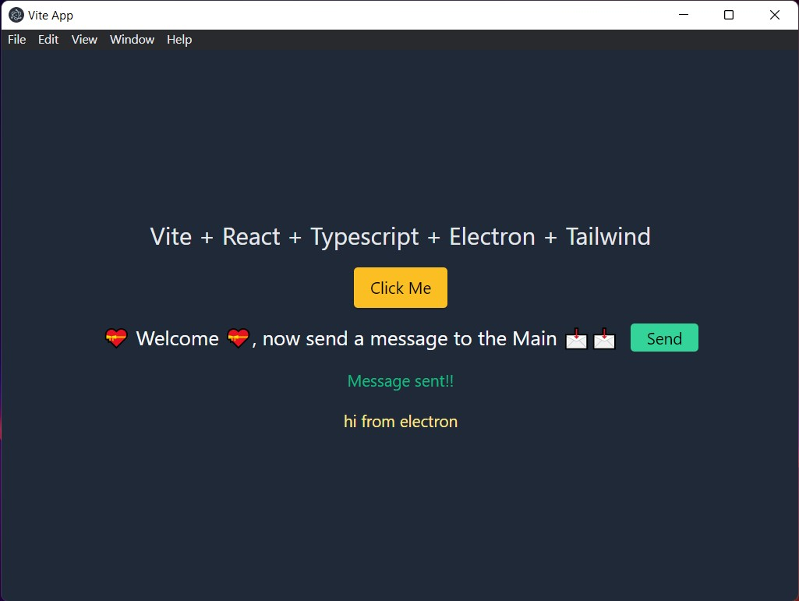

# -

- https://zenn.dev/todesking/articles/90d05f92d49461
- https://zenn.dev/thirosue/books/49a4ee418743ed/viewer/57d161
- https://www.electron-trpc.dev/
- https://flowbite.com/
- https://tech.fusic.co.jp/posts/2023-05-23-electron-trpc/

## 欲しい機能

- [x] clipboard の内容を永続的に保存する
- [x] 保存した clipboard の内容を文字列で検索する
- [ ] 保存した clipboard の内容を日付で検索する
  - [#4](https://github.com/IrukNuj/RepickClip/issues/4)
- [ ] 簡単に一覧から clipboard にコピーできる
  - [#5](https://github.com/IrukNuj/RepickClip/issues/5)
  - [ ] Repick 回数を記憶、Sort 出来るようにする
    - [#6](https://github.com/IrukNuj/RepickClip/issues/6)
- [ ] clipboard をブックマーク出来る
  - [#7](https://github.com/IrukNuj/RepickClip/issues/7)
- [ ] 一定期間経過した clipboard のデータを削除できる
  - [#8](https://github.com/IrukNuj/RepickClip/issues/8)
- [ ] [row] ダークモードライトモードの切り替え
  - [#9](https://github.com/IrukNuj/RepickClip/issues/9)
- [ ] tag 機能とか？
  - [#10](https://github.com/IrukNuj/RepickClip/issues/10)
- [ ] Filter コンポーネントの切り出し
  - [#11](https://github.com/IrukNuj/RepickClip/issues/11)
- [ ] `electron-trpc`の導入
  - [#12](https://github.com/IrukNuj/RepickClip/issues/12)
- [ ] copiedTab の 記憶(chrome とか discord)
<!-- # Vite + React + Typescript + Electron - Starter

> It is a simple starter template without unnecessary packages.

This very simple Starter template, utilizes [Vite](https://github.com/vitejs/vite), [Tailwind](https://tailwindcss.com/), [React](https://reactjs.org/), [Typescript](https://www.typescriptlang.org/) and [Electron](https://electronjs.org/).

By default, the React framework is used for the interface, but you can easily use any other framework such as Vue, Preact, Angular, Svelte or anything else.

> Vite is framework agnostic

## Installation

Clone this repo and install all dependencies
`yarn` or `npm install`

## Development

`yarn dev` or `npm run dev`

## Build

`yarn build` or `npm run build`

## Publish

`yarn dist` or `npm run dist`

## More advanced templates

If you are looking for more advanced templates than this, please go to one of the following links (these are some other links out of the **[awesome-vite](https://github.com/vitejs/awesome-vite)** repo) or you can help me make this template better 🙂

Links:

- [vite-react-electron](https://github.com/caoxiemeihao/vite-react-electron)
- [electron-vite-react](https://github.com/twstyled/electron-vite-react)
- [vite-electron-esbuild-starter](https://github.com/jctaoo/vite-electron-esbuild-starter) -->
